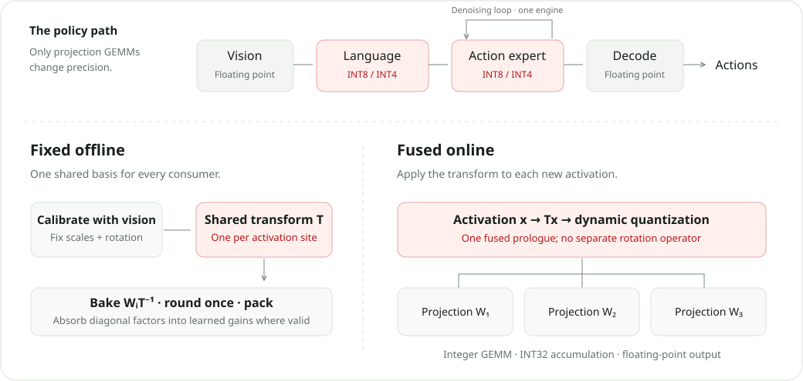

<p align="center">
  <picture>
    <source media="(prefers-color-scheme: dark)" srcset="docs/assets/foldquantvla-wordmark-dark.svg">
    
  </picture>
</p>

<p align="center">
  
  
  
  
  
  <a href="LICENSE"></a>
</p>

**FoldQuantVLA: Native Low-Bit Quantization for Vision-Language-Action
Inference on Edge GPUs via Unified Offline Folding**

Native low-bit — W8A8 and W4A4 executed on the device's INT8 / INT4 tensor
cores, not simulated — quantization for vision-language-action (VLA)
inference on edge GPUs via **unified offline folding**: the SmoothQuant
scale, a per-block rotation and the weight rounding are folded into each
linear site's weights before export, so at inference a single fused TensorRT
plugin quantizes the activation row, runs the INT4 / INT8 GEMM and
dequantizes — no online rotation, no per-token scale search, no extra graph
nodes between the plugin and its neighbours.

## Highlights

- **Native low bit, not simulated.** W8A8 and W4A4 run on the device's INT8 / INT4 tensor cores through one fused TensorRT plugin per linear site; no online rotation, no per-token scale search, no extra graph nodes.
- **One fold, offline.** SmoothQuant scale, block rotation and GPTQ rounding are composed into a single consistent transform `T_v = D^o R D^i` and folded into the weights before export. Every fold is in the weights; the runtime only quantizes rows.
- **Six VLA releases, one build path.** GR00T N1.5 / N1.6 / N1.7, π₀.₅, SmolVLA and Evo-1 — upstream code, evaluation harness and policy server used unchanged; float, W8A8 and W4A4 engines come off the same `export → build → install` path and differ only in the precision of the projections.
- **Action-referenced calibration.** Presets are selected on decoded actions of the assembled pipeline (fidelity, then closed-loop success), with a floating-point engine of the same scope as the control every latency claim is measured against.
- **Deployable.** Engines install into the upstream release's own policy server; the same arm serves LIBERO, a Jetson AGX Orin and a real robot, driven by the family's own upstream client (see [`docs/`](docs)).

## How it works

Only the projection GEMMs change precision. The vision encoder and the decoder
stay floating point; the language backbone and the action expert run INT8 or
INT4, and the action expert's denoising loop reuses one engine for every step.

<p align="center">
  <picture>
    <source media="(max-width: 700px)" srcset="docs/assets/foldquantvla-method-mobile.svg">
    
  </picture>
</p>

One plugin serves the GR00T DiT, the Evo-1 action head and the SmolVLA / π₀.₅ experts through their own emitters; the LLM backbones use the INT8 per-row path (`w8a8_sr`) or the INT4 path (`w4a4_srg`) with the same weight contract.

This repository is the paper's artifact. It has two parts:

- **[`foldquant/`](foldquant)** — the algorithm, the ONNX emitters and the
  TensorRT plugin kernels. Model-agnostic; installed as a Python package into
  each model's own environment.
- **`models/<family>/`** — one directory per VLA release, a trimmed copy of
  the upstream repository at a pinned commit plus a `foldquant_integration/`
  folder. Upstream code, data path, evaluation harness and deployment tools
  are used **unchanged**; the integration only emits the FoldQuant graphs for
  the modules it quantizes and slots them into the upstream TensorRT pipeline.

| family | upstream | integration | support |
|---|---|---|---|
| GR00T N1.7 | NVIDIA Isaac GR00T, `n1.7-release` (`23ace64f`) | [`models/groot_n1_7`](models/groot_n1_7/foldquant_integration/README.md) | ✓ |
| GR00T N1.6 | NVIDIA Isaac GR00T, `n1.6.1-release` (`5dc80c4a`) | [`models/groot_n1_6`](models/groot_n1_6/foldquant_integration/README.md) | ✓ |
| GR00T N1.5 | NVIDIA Isaac GR00T, `n1.5-release` (`4af2b622`) | [`models/groot_n1_5`](models/groot_n1_5/foldquant_integration/README.md) | ✓ |
| π₀.₅ | openpi, `main` (`215abfb2`) | [`models/pi05`](models/pi05/foldquant_integration/README.md) | ✓ |
| SmolVLA | LeRobot, `v0.6.1` (`7e241bd6`) | [`models/smolvla`](models/smolvla/foldquant_integration/README.md) | ✓ |
| Evo-1 | MINT-SJTU Evo-1, `main` (`5fd14b01`) | [`models/evo_1`](models/evo_1/foldquant_integration/README.md) | ✓ |

**✓ means the whole chain runs**: export, engine build, held-out drift,
latency benchmark, a LIBERO rollout and a policy server a real robot can be
pointed at, for every scheme the family offers. All six are there. π₀.₅ and
Evo-1 earn it on the same terms, with one difference that is upstream's design
and not a gap: their LIBERO rollout drives an upstream client from a second
environment against a running server, where the other four run it in process.

What has been **measured and committed** is a narrower claim, and it belongs in
[`results/`](results/README.md) rather than in this table. Held-out drift and
desktop latency are recorded there for all six. **LIBERO success rate is not**:
those sweeps run on the evaluation cluster, and every success-rate cell reads
_Pending_ until they land. Jetson AGX Orin latency is pending for the same
reason — the board is not this machine.

All six families now have a float arm. `--llm-scheme float` traces the module
through the deployed forward and emits an unquantized engine of the same
scope, so a release shipping no TensorRT path of its own is no longer a
reason to lack one.

## Schemes

A scheme key is `w{W}a{A}` followed by the fold it applies, one letter per pass
in a fixed order: `s` SmoothQuant scale, then `r` (learned dense block
rotation) or `h` (fixed Sylvester butterfly, applied as an FWHT), then `g`
GPTQ rounding. `w8a8` alone is the dynamic per-row baseline and folds nothing.

`float` is the unquantized engine of a module — the floor of every ladder and
the compiled control the latency table divides by. It is traced, not emitted:
`foldquant/float_export.py` captures the module's real call and exports it
under the runtime's binding names, so `build_engines` compiles it and
`install_engines` serves it like any other arm. `none` keeps the module in
PyTorch instead. On GR00T N1.7 the FoldQuant graphs share upstream's
full-pipeline I/O contract, so `float` there takes upstream's own export
(`build_engines --float-onnx-dir`).

The float engine is built **strongly typed**, like every quantized arm, and
with no plugins. That is not a detail: a weakly-typed network picks a precision
per layer, and the layers TensorRT then chooses to run in fp32 are *more* exact
than the bf16 reference the arm is scored against — which once made a float
engine drift further from PyTorch than its own INT8 engine did. Honouring the
ONNX's own dtypes keeps float a control that differs from the quantized arms in
the precision of the projections and in nothing else.

| target | schemes | plugin library |
|---|---|---|
| action expert (DiT / action head / expert) | `w4a4_shg` · `w4a4_sh` · `w4a4_sr` · `w8a8_sh` · `w8a8` | `foldquant_int4_per_row` / `foldquant_int8_per_row` |
| LLM backbone | `w8a8_sr` · `w8a8_s` · `w4a4_srg` · `w4a4_sg` · `w4a8_srg` | same, by activation width |
| W4A16 baseline | ModelOpt AWQ groupwise | `foldquant_int4_groupwise` |

`foldquant/schemes.py` is the single source of these names and of which
modules each is allowed on. GPTQ (`…g`) changes nothing at runtime — same
kernel, node attributes and byte layout — it only spends the same 16 levels
better, so every `_shg` engine runs at the `_sh` engine's latency.

## Layout

```
foldquant/            algorithm (foldq.py), calibration, emitters, export API
  kernels/            TensorRT plugin sources (CUDA + CUTLASS), locator, build CLI
  runtime/            plugin loading, engine build helper, engine wrapper
models/groot_n1_7/    upstream GR00T N1.7 + foldquant_integration/
models/groot_n1_6/    upstream GR00T N1.6.1 + foldquant_integration/
models/groot_n1_5/    upstream GR00T N1.5 + foldquant_integration/
models/pi05/          upstream openpi (π₀ / π₀.₅ PyTorch path) + foldquant_integration/
models/smolvla/       upstream LeRobot (SmolVLA + its LIBERO evaluator) + foldquant_integration/
models/evo_1/         upstream Evo-1 (InternVL3 tower + flow-matching head) + foldquant_integration/
third_party/          CUTLASS (submodule), vendored TensorRT public headers
tests/                unit tests for the algorithm, emitters, kernel locator / build
results/              evaluation protocol and measured results
docs/deploy/          export on a workstation, build and test on Jetson AGX Orin
```

## Install

Each model directory pins its own environment (Python, torch, TensorRT); the
`foldquant` package installs into it:

```bash
git submodule update --init third_party/cutlass
cd models/groot_n1_7 && uv sync && uv pip install -e ../..
python -m foldquant.kernels build      # compiles the plugin .so for this GPU / TensorRT
python -m foldquant.kernels status
```

Each integration README lists the family's own environment (GR00T N1.6 / N1.5
pin older torch and flash-attn wheels; openpi pins Python 3.11 and copies its
patched `transformers` files over the installed package) and which submodule
it needs — the LIBERO harness is pinned per family
(`models/groot_n1_{7,6}/external_dependencies/LIBERO`,
`models/pi05/third_party/libero`; the N1.5 release pins none, so its README
points at upstream's install steps).

Kernels build with `nvcc`, the CUTLASS submodule and the vendored TensorRT
headers; binaries are cached per `(SM, machine, TensorRT major.minor)` under
`~/.cache/foldquant` and matched exactly at load, never approximately. Unit
tests need only the package:

```bash
pip install -e ".[dev]" && pytest tests -q
```

Then follow the family's integration README, e.g.
[GR00T N1.7](models/groot_n1_7/foldquant_integration/README.md): float
export/engines with the upstream pipeline → `export_foldquant` → `build_engines`
→ `verify` / `eval_libero` / `benchmark`.

## Results

[`results/README.md`](results/README.md) describes the protocol (upstream
harnesses, held-out drift, LIBERO success rate, latency on RTX 4070 Ti SUPER
and Jetson AGX Orin) and holds the measured numbers per family and arm.

[`docs/REPRODUCING.md`](docs/REPRODUCING.md) says what can be checked and at
what cost, from a clone upwards:

- `python scripts/check_records.py` — no GPU, no checkpoint: asserts the
  invariants every record has to satisfy.
- `scripts/smoke_family.sh` — one family's export → build → verify chain on
  eight observations.
- `scripts/smoke_serve.sh` — each family's policy server starts and binds,
  over bf16 or over a built arm.
- `scripts/smoke_eval.sh` — one LIBERO suite at one episode per task, through
  the same `eval_libero` the sweeps use.

A smoke pass means the chain runs, not that a published number reproduces.
Reproducing a number needs the checkpoint and dataset that number's record
names, which every record now carries.

## Deploying

Engines install into the **upstream release's own policy server**, so an
unmodified upstream client drives a quantized policy by changing a host and a
port. Each family's own repository documents its client and its real-robot
examples; nothing here replaces them.

One rule governs all of it: quantization changes the arithmetic, not the
policy. An engine built from a LIBERO checkpoint emits LIBERO actions on any
robot, so a real deployment starts from a checkpoint fine-tuned for that
embodiment.

[`docs/deploy/jetson.md`](docs/deploy/jetson.md) covers the edge target the
paper measures: what has to be built on the board itself — the plugin library
and the engines, because neither is portable across `(SM, TensorRT)` — versus
what crosses from a workstation as ONNX.

## License

FoldQuant code is released under the
[PolyForm Noncommercial License 1.0.0](LICENSE) for research use. Upstream
model code under `models/*/` and third-party sources keep their own licenses
(Apache-2.0 / BSD-3-Clause), retained alongside them. See
[CITATION.cff](CITATION.cff) to cite.
